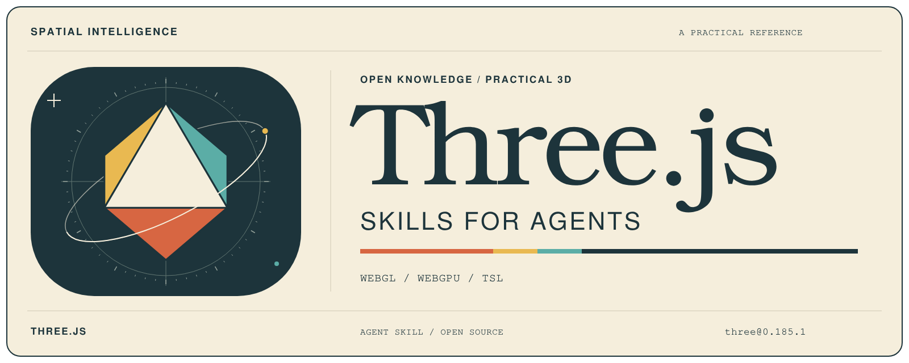

<p align="center">
  <a href="assets/threejs-skills-for-agents.svg"></a>
</p>

# Three.js Skills for Agents

This repository provides one `threejs` skill for agents building, debugging, migrating, or optimizing Three.js applications. It covers scene setup, rendering, assets, interaction, shaders, post-processing, and teardown. Guidance is checked against official Three.js sources.

The skill targets exactly npm `three@0.186.1` (revision 186). This published patch is the chosen distribution for the r186 upgrade; use it consistently rather than a floating `latest`, caret range, or mixed r186 files. [r186 package manifest](https://github.com/mrdoob/three.js/blob/r186/package.json)

## Capabilities

- Build WebGL and WebGPU scenes with cameras, transforms, resize handling, and render loops.
- Choose compatible geometry, Gaussian splats, materials, retroreflectivity, lighting, probe grids, shadows, textures, render targets, and color management.
- Load GLTF/GLB, compressed assets, and Gaussian splats; play animation, handle pointer interaction, and clean up owned resources.
- Write or review GLSL, TSL, node materials, AO, OIT, and post-processing pipelines.
- Diagnose rendering, import, capability, color, readiness, lifecycle, and performance problems.
- Migrate older Three.js code to the pinned revision instead of mixing release conventions.

## Package

`skills/threejs` is the single package. Agents discover it through [`SKILL.md`](skills/threejs/SKILL.md), which routes matched tasks to the relevant guidance under `references/` as needed. Copying the complete directory preserves this progressive-disclosure structure.

## Installation

Use the [skills CLI](https://github.com/vercel-labs/skills):

```bash
npx skills add PhilosophiMoonbeam/threejs-skills
```

Follow the prompts to choose your agent and installation scope.

### Manual installation

For a custom skill directory, clone the repository and copy the complete package:

```bash
git clone https://github.com/PhilosophiMoonbeam/threejs-skills.git
AGENT_SKILLS_DIR=/absolute/path/to/agent/skills
mkdir -p "$AGENT_SKILLS_DIR"
cp -R threejs-skills/skills/threejs "$AGENT_SKILLS_DIR/threejs"
```

The installed package remains `$AGENT_SKILLS_DIR/threejs/`, with `SKILL.md` and `references/`. Replace that directory as a unit when updating an installation so removed or renamed references do not remain.

## Example prompts

> Create a responsive Three.js WebGL scene with an instanced mesh and deterministic teardown.

> Build a Three.js WebGPU scene with TSL compute, then provide an explicit path when WebGPU is unavailable.

> Load a Draco-compressed GLB, play one animation clip, and dispose of resources during teardown.

> Migrate this older post-processing pipeline to `three@0.186.1` and explain each required API change.

## Source and version policy

Target exactly `three@0.186.1` / revision 186 throughout. Use these public package exports: `three`, `three/webgpu`, `three/tsl`, and `three/addons/...`. Keep core, addon, CDN, decoder, and shader sources on revision 186. Use the fetched exact npm package and tagged source for APIs and revision-sensitive behavior:

- [Revision 186 source tag](https://github.com/mrdoob/three.js/tree/r186) and [revision 186 package exports](https://github.com/mrdoob/three.js/blob/r186/package.json)
- [Three.js migration guide](https://github.com/mrdoob/three.js/wiki/Migration-Guide), applying only changes through 185 → 186
- [Three.js documentation](https://threejs.org/docs/), [manual](https://threejs.org/manual/), and [LLM index](https://threejs.org/docs/llms.txt) for conceptual guidance; current pages may already describe later revisions

Adjacent official citations identify the source for version-sensitive guidance. Historical revision labels and tagged links remain when they document an earlier upstream change; they do not establish a second current target.

The package follows the [Agent Skills specification](https://agentskills.io/specification). The repository identity artwork is available as the [SVG source](assets/threejs-skills-for-agents.svg). Its outlined lettering needs no installed fonts. After installing the maintainer dependencies and Chromium below, run `npm run render:artwork` to regenerate the README PNG from the SVG.

## Validation

From the repository root, validate the package with the published reference validator:

```bash
uvx --from skills-ref agentskills validate ./skills/threejs
```

Maintainer checks live in `checks/`, outside the installed skill. With Node.js 22 or later:

```bash
npm ci
npm run check
npx playwright install chromium
npm run check:browser
git diff --check
```

The checks validate local links, routing, JavaScript syntax, and imports against the exact locked package; they also execute documented operational examples. Browser checks cover renderer and canvas teardown, sizing, assets, PMREM ownership, standalone raw KTX2 loading (not Basis transcoding), post-processing, node materials, and compute on WebGL 2 fallback and WebGPU. An unavailable WebGPU adapter is a skip, not native-backend evidence. Run `REQUIRE_WEBGPU=1 npm run check:browser` to require native WebGPU coverage; record the exercised backend and any unsupported capability branch, including OIT indexed blending. Headless software rendering checks correctness, not target-device performance. Source review establishes API contracts; executed checks establish only the behavior they cover.

Use the [behavior evaluation cases](checks/scenarios.md) to compare agent task scope, outcomes, and context use across skill revisions. Skill installation requires only `skills/threejs/`; maintainer dependencies and evaluation fixtures stay in this repository.

## Contributing

- Keep `skills/threejs/` as the only package and `SKILL.md` as its activation file.
- Put routing in `SKILL.md` and domain guidance in the owning references; keep references independent.
- Keep examples minimal, lifecycle-aware, revision-pinned, and grounded in official sources.
